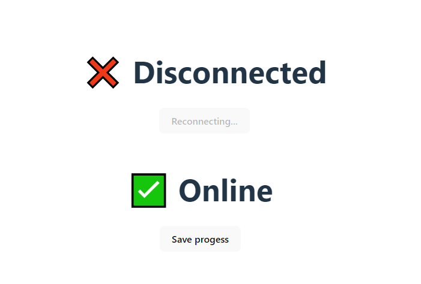

<h1 align="center">Criando Hooks Customizados no React</h1>

## 🖥️ Projeto
Criando Hook customizado no react para sinalizar se o cliente está conectado a rede.

## 🚀 Tecnologias
Esse projeto foi desenvolvido utilizando as seguintes tecnologias:

- HTML
- CSS
- JAVASCRIPT
- REACT
- HOOKS