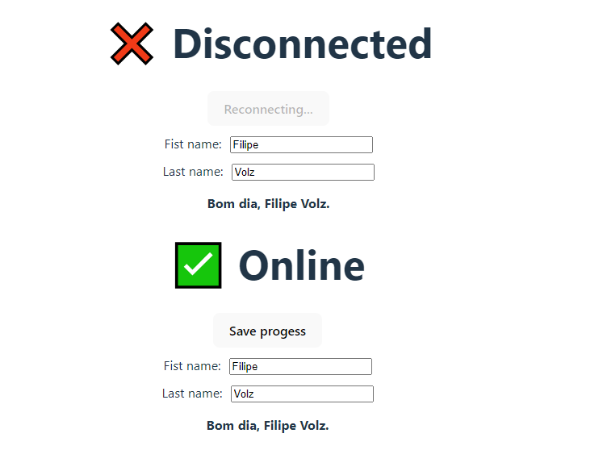

<h1 align="center">Criando Hooks Customizados no React</h1>

## 🖥️ Projeto
Hook customizado no REACT para sinalizar se o cliente está conectado a rede.

## ❕❕ Instalar dependencias
Para utilizar o código enviado neste repositório, é necessário instalar as dependências utilizando o comando "npm install" e para rodar pode ser usado o comando "npm run dev"

## 🚀 Tecnologias
Esse projeto foi desenvolvido utilizando as seguintes tecnologias:

- HTML
- CSS
- JAVASCRIPT
- REACT
- HOOKS
